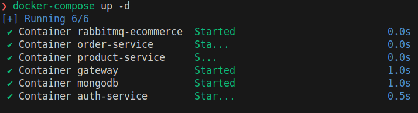

# E-Commerce Microservices Backend with BUN and Express.js

## Overview

microservices backend application using BUN ,
Express.js and RabbitMQ as Message Broker

## Architecture

- microservice backend application

## Installation

clone the repository :

```
git clone https://github.com/BigBr41n/Bun-Microservice-Backend
```

and for each service run :

```
bun install
```

or using bash :

```
#!/bin/bash

# Change directory to the main folder
cd cloned/folder

# Loop through each subdirectory
for dir in */; do

    echo "Entering directory: $dir"
    cd "$dir"

    # Run bun install
    bun install

    # Move back to the main folder
    cd ..
done

echo "Installation completed."

```

## Usage

- the gateway the only way access to the service which is a simulation to a real app

## Screenshots



Feel free to customize the project
